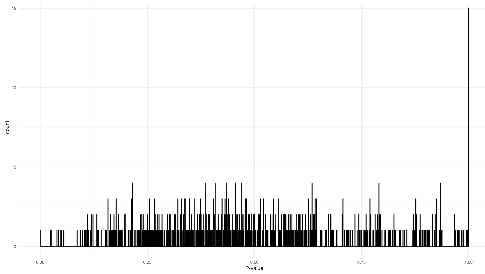

```{r include=FALSE}
knitr::opts_chunk$set(echo = TRUE, 
  fig.width = 12, 
  fig.height = 12,
  message = FALSE, 
  warning = FALSE)
```


```{r}
library(tidyverse)
library(phyloseq)
library(genefilter) #KOverA
#remotes::install_github("PratheepaJ/BARBI")
#library(BARBI) let's call functions from BARBI explicitly 
devtools::load_all()
```


## 4.2 Additive and Multiplicative Errors

DNA contamination is identified as additive error. For contamination removal, in the presence of negative controls, we use statistical mixture model. For further references, we recommend the [BARBI tutorial](https://pratheepaj.github.io/BARBI/). 

### Identify negative controls

```{r}
sample_data(psE)$is.neg <- (
  sample_data(psE)$community == "PAO") | (sample_data(psE)$community == "Water") | (sample_data(psE)$community == "WATER") | (sample_data(psE)$community == "MOCK")

if(dim(otu_table(psE))[1]!=ntaxa(psE)){
  otu_table(psE) <- t(otu_table(psE))
}


```

### Adding blocks/batches

```{r}
blocks <- rep(
  "Set1", 
  nsamples(psE)
  )

sample_data(psE)$block <- blocks
```


### Remove taxa only in negative control specimens

```{r}
SampleType <- ifelse(
  sample_data(psE)$is.neg, 
  "Control", 
  "Cases"
  )
sample_data(psE)$SampleType <- SampleType

ps_specimen <-  subset_samples(
  psE, 
  SampleType %in% c("Cases")
  )

prevTaxaP <- apply(
  otu_table(ps_specimen), 
  1,
  function(x){sum(x>0)}
  )

Contaminants1 <- names(
  prevTaxaP
  )[prevTaxaP == 0]

psE <- prune_taxa(
  prevTaxaP > 0, 
  psE
  )
psE

table(
  sample_data(psE)$SampleType,
  sample_data(psE)$block
  )
```


### Prepare the phyloseq object for the BARBI method

```{r eval=FALSE}
psBlockResult <- BARBI::psBlockResults(
  psE, 
  sampleTypeVar = "SampleType",
  caselevels = c("Cases"),
  controllevel = c("Control"),
  sampleName = "unique_names", 
  blockVar = "block")

psByBlock <- psBlockResult[[1]]
psNCbyBlock <- psBlockResult[[2]]
psallzeroInNC <- psBlockResult[[3]]
psPlByBlock <- psBlockResult[[4]]
```

### Estimate the density parameters for the contaminant intensities in negative control samples

```{r eval=FALSE}
con_int_neg_ctrl <- BARBI::alphaBetaNegControl(
  psNCbyBlock = psNCbyBlock
  )
```

### Estimate the density parameters for the contaminant intensities in each specimen

```{r eval=FALSE}
num_blks <- length(con_int_neg_ctrl)
blks <- seq(1, num_blks) %>% as.list

con_int_specimen <- lapply(blks, function(x){
    con_int_specimen_each_blk <- BARBI::alphaBetaContInPlasma(
      psPlByBlock = psPlByBlock, 
      psallzeroInNC = psallzeroInNC,
      blk = x,
      alphaBetaNegControl = con_int_neg_ctrl)
    
    return(con_int_specimen_each_blk)
})
```

### Sample from the marginal posterior for the true intensities

```{r eval=FALSE}
itera <- 1000
t1 <- proc.time()

mar_post_true_intensities <- lapply(blks, function(x){
    mar_post_true_intensities_each_blk <- BARBI::samplingPosterior(
      psPlByBlock = psPlByBlock,
      blk = x,
      gammaPrior_Cont = con_int_specimen[[x]],
      itera = itera)
    
    return(mar_post_true_intensities_each_blk)
})

proc.time()-t1

con_int_specimen_mar_post_true_intensities <- list(con_int_specimen, mar_post_true_intensities)

saveRDS(con_int_specimen_mar_post_true_intensities, "con_int_specimen_mar_post_true_intensities.rds")# this is a too large data set so we didn't include to build the website.
```

### Save phyloseq after removing DNA contamination

```{r eval=FALSE}
ASV <- as.character(
  paste0("ASV_",
         seq(1, ntaxa(psE)
             )
         )
  )

ASV.Genus <- paste0(
  "ASV_",
  seq(1,ntaxa(psE)),
  "_",
  as.character(tax_table(psE)[,6])
  )

ASV.Genus.Species <- paste0(
  ASV,
  "_",
  as.character(tax_table(psE)[,6]),
  "_",
  as.character(tax_table(psE)[,6])
  )

df.ASV <- data.frame(
  seq.variant = taxa_names(psE), 
  ASV = ASV, 
  ASV.Genus = ASV.Genus,
  ASV.Genus.Species = ASV.Genus.Species
  )

itera <- 1000
burnIn <- 100
cov.pro <- .95
mak_tab <- FALSE # Save tables or print tables 


con_int_specimen <- con_int_specimen_mar_post_true_intensities[[1]]
mar_post_true_intensities <- con_int_specimen_mar_post_true_intensities[[2]]

## Keep true 
all_true_taxa_blk <- list()

for(blk in 1:num_blks){

  mar_post_true_intensities_blk <- mar_post_true_intensities[[blk]]
  con_int_specimen_blk <- con_int_specimen[[blk]]

  all_true_taxa <- character()

  for(sam in 1:nsamples(psPlByBlock[[blk]])){
      taxa_post <- mar_post_true_intensities_blk[[sam]]
      acceptance <- list()
      lower.r <- list()
      upper.r <- list()
      lower.c <- list()
      upper.c <- list()
      all.zero.nc <- list()

      for(taxa in 1:length(taxa_post)){
        burnIn  <- burnIn
        acceptance[[taxa]]  <-  1 - mean(
          duplicated(
            taxa_post[[taxa]][-(1:burnIn),]
            )
          )

        HPD.r <- hdi(
          taxa_post[[taxa]][-(1:burnIn),],
          credMass = cov.pro
          )
        
        lower.r[[taxa]] <- round(HPD.r[1], digits = 0)
        upper.r[[taxa]] <- round(HPD.r[2], digits = 0)
        
        lamda.c <- rgamma(
          (itera-burnIn+1), 
          shape= con_int_specimen_blk[[sam]][[1]][taxa],
          rate = con_int_specimen_blk[[sam]][[2]][taxa]
          )
        
        HDI.c <- hdi(
          lamda.c, 
          credMass = cov.pro
          )
        
        lower.c[[taxa]] <- round(
          HDI.c[1], 
          digits = 0
          )
        
        upper.c[[taxa]] <- round(
          HDI.c[2], 
          digits = 0
          )
        
        all.zero.nc[[taxa]] <-  con_int_specimen_blk[[sam]][[5]][taxa]
      }

    tax_names <- taxa_names(
      psPlByBlock[[blk]]
      )
    
    tax_names <- df.ASV$ASV.Genus[which(
      as.character(df.ASV$seq.variant) %in%  tax_names
      )]
      
    df <- data.frame(
      Species = tax_names,
      xj = as.numeric(con_int_specimen_blk[[sam]][[3]]),
      l.r = unlist(lower.r),
      u.r = unlist(upper.r),
      l.c = unlist(lower.c),
      u.c = unlist(upper.c),
      all.zero.nc = unlist(all.zero.nc)
      )
      
    
      # List all true taxa
      df <- arrange(
        filter(
          df,
          (l.r > u.c) & (l.r > 0)
          ),
        desc(xj)
        )

      # If there is no true taxa
      if(dim(df)[1]==0){
          df <- data.frame(
            Species="Negative",
            xj="Negative",
            l.r="Negative",
            u.r="Negative",
            l.c ="Negative",
            u.c="Negative",
            all.zero.nc = "Negative"
            )
      }

    
      
      # collect all true taxa in the specimen
      all_true_taxa <- c(
        all_true_taxa,
        as.character(df$Species)
        )

      all_true_taxa <- unique(all_true_taxa)
  }

  all_true_taxa_blk[[blk]] <- all_true_taxa
}


```


### Remove DNA contamination

```{r eval=FALSE}
contaminant_asv_barbi <- df.ASV$seq.variant[which(
  !(df.ASV$ASV.Genus %in% all_true_taxa_blk[[blk]])
  )] %>% 
  as.character()

not_contaminant_asv_barbi <- df.ASV$seq.variant[which(
  df.ASV$ASV.Genus %in% all_true_taxa_blk[[blk]]
  )] %>% 
  as.character()

psE_BARBI <- prune_taxa(
  not_contaminant_asv_barbi, 
  psE
  )

```


### After DNA contamination removal, remove control specimens and save the phyloseq for further analysis

```{r eval=FALSE}
psE_BARBI <- subset_samples(
  psE_BARBI, 
  community != "PAO" & community != "MOCK" & community != "Water" & community != "WATER"
  )
psE_BARBI

saveRDS(psE_BARBI, "psE_BARBI.rds")
```

```{r}
psE_BARBI
```

We used the remaining 5,808 ASVs in 86 specimens for our downstream analysis.


## 4.1 Goodness of fit for taxon counts

We show that a negative binomial distribution (or equivalently gamma-Poisson) fits our example data set for the ASV counts well. We test the null hypothesis, H0, that the ASV counts have a negative binomial distribution using a chi-square test statistic. 

The testing procedure is as follows:

1. Estimate parameters of negative binomial from the data.

2. We draw 1000 simulations from the negative binomial with the parameters estimated from the data. 

3. We compute the test statistic on osberved data and simualted data. 

4. We compute P-values for all ASVs.

5. We plot the distribution of P-values.

6. We adjusted P-values for multiple testing.

Note: we used phyloseq after removing DNA contaminants using BARBI (Section 4.2).

```{r}
psE_BARBI
# set threshold values (require at least 5 samples with 25 reads)
threshold <- kOverA(5, A = 25) 
psE_BARBI <- filter_taxa(
  psE_BARBI, 
  threshold, 
  TRUE
  ) 
psE_BARBI


psE_BARBI <- prune_taxa(
  taxa_sums(psE_BARBI) > 0, 
  psE_BARBI
  )
psE_BARBI
```

### Estimate parameters of negative binomial distribution

```{r message=FALSE, warning=FALSE, eval=FALSE}
dd <- otu_table(psE_BARBI) %>% t() %>% 
  data.frame()# samples * asv
rownames(psE_BARBI) <- NULL
colnames(psE_BARBI) <- NULL

estnb <- matrix(0, ncol=2, nrow=ncol(dd))

#for each asv, fit the nb and estimate prob and theta
for(x in 1:ncol(dd)){
    fit.nb <- fitdistr(dd[,x], densfun = "negative binomial") 
    estnb[x,] <- cbind(fit.nb$estimate[[1]] ,fit.nb$estimate[[2]] )
}

prob <- estnb[,2]/(estnb[,1]+estnb[,2])
theta <- estnb[,1]
estnb <- cbind(estnb, prob, theta)
estnb <- as.data.frame(estnb) 
colnames(estnb) <- c("size", "mu", "prob","theta")
estnb <- estnb %>% as_tibble()

```

### Goodness of fit for each asv - Monte Carlo method

Simulate 1000 of replicates for each ASV. For each replicate, compute chi-square test statistic. Compare the observed chi-square value with these 1000 test statistic values. 

```{r eval=FALSE}
dd <- otu_table(psE_BARBI) %>% t() %>% 
  data.frame()# samples * asv matrix
rownames(dd) <- NULL
colnames(dd) <- NULL

# For each ASV, compute expected count given NB(mu, size)
# this will be used for observed count and 1000 MC simulations 
expectedCount <- function(n, 
                          mu, 
                          size, 
                          breaks){
  # make bins and compute expected counts for each bin assuming NB
  n * diff(pnbinom(breaks, 
                   mu = mu, 
                   size = size))
}
  

```


### Compute chi-square test statistic

```{r eval=FALSE}
chiSquareSim <- function(x, 
                         mu, 
                         size, 
                         breaks){
  breaks <- breaks
  observed <- table(cut(x, breaks))
  n <- length(x)
  
  expected <- expectedCount(n, 
                              mu = mu, 
                              size = size, 
                              breaks = breaks)
  # test statistic
  chi_square <- (sum((observed - expected)^2 / expected))/(length(breaks)-1)
    
  return(list(chi_square = chi_square))
  
}
```

### Use Monte Carlo method to do goodness of fit test

```{r eval=FALSE}
comPvalueForEachASV <- function(x, b){
  # x is the observed ASV count
  # b is the number of bins to compute chi-square test statistic. This is used to create breaks.
  
  #for each asv, fit nb and estimate mu and size 
  fit.nb <- fitdistr(x, 
                     densfun = "negative binomial") 
  size <- fit.nb$estimate[[1]] 
  mu <- fit.nb$estimate[[2]]
  
  # for each asv, simulate 1000 data from NB(with estimated parameters)
  sim_x <- matrix(rnbinom(length(x)*1000, 
                          size = size, 
                          mu = mu), 
                  nrow = length(x)) %>% 
    data.frame()
    
  
  # create same number of bins = b using the range of sim_x and x
  breaks <- c(
    min(sim_x,x) - .1, 
    seq(min(sim_x, x), 
        max(sim_x, x), 
        length.out = b), 
    Inf
    )
    
  # For each replicate of the ASV, compute chi-square statistic
  sim_results <- apply(sim_x, 2, function(y){
      chiSquareSim(y, 
                   mu = mu, 
                   size = size, 
                   breaks = breaks)$chi_square
    })
      
  # compute observed chi-square statistic value
  chi_square0 <- chiSquareSim(x, 
                              mu = mu, 
                              size = size, 
                              breaks = breaks)$chi_square
    
  p_value_sim <- mean(sim_results >= chi_square0)
  return(list(p_value_sim, chi_square0, sim_results))
}
```


```{r message=FALSE, warning=FALSE, eval=FALSE}
b <- 30
p_value_asv <- numeric()
chi_square0 <- numeric()
mc_test <- list()
for(i in 1:ncol(dd)){
  mc_test[[i]] <- comPvalueForEachASV(x = dd[,i], b = b)
}
```

### Plot P-values of the goodness of fit test

```{r eval=FALSE}
# we can load mc_test which includes the goodness of fit test results 

dd <- otu_table(psE_BARBI) %>% 
  t() %>% 
  data.frame()# samples * asv matrix
rownames(dd) <- NULL
colnames(dd) <- NULL

p_value_asv <- numeric()
chi_square0 <- numeric()
sim_results <- list()

for(i in 1:ncol(dd)){
  p_value_asv[i] <- mc_test[[i]][[1]]
  chi_square0[i] <- mc_test[[i]][[2]]
  sim_results[[i]] <- mc_test[[i]][[3]]
}


ggplot(data = tibble(p_value_asv = p_value_asv), 
       aes(x = p_value_asv)) +
  geom_histogram(bins = 1000) + 
  xlab("P-value") + 
  theme_bw()

```


```{r echo=FALSE, out.width="100%", fig.cap = "Supplementary Figure 1: P values for goodness of fit test of negative binomial distribution for each taxon.", fig.align="center"}

```

### Compute adjusted P-values.

```{r eval=FALSE}
sum(p.adjust(p_value_asv, method = "BH") <= .05)
#0
```

```{r include=FALSE}
rm(blks, con_int_neg_ctrl, con_int_specimen, dd, ps_specimen, psallzeroInNC, psBlockResult, psByBlock, psE, psNCbyBlock, psPlByBlock, sim_results, blocks, chi_square0, Contaminants1, i, num_blks, p_value_asv, prevTaxaP, SampleType)
```


## 4.3 Library size scaling factor

We account for the library sizes (the column sums of the ASV contingency table) using median-of-ratios algorithm implemented in DESeq2.


