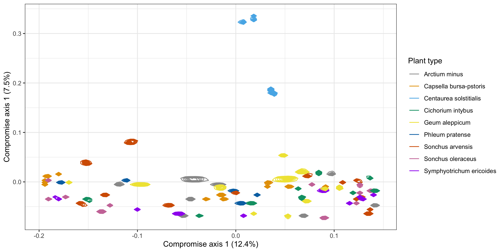

```{r include=FALSE}
knitr::opts_chunk$set(
  echo = TRUE, 
  fig.width = 7, 
  fig.height = 4, 
  fig.align = 'center',
  message = FALSE, 
  warning = FALSE
  )
```

```{r}
library(phyloseq)
library(tidyverse)
library(genefilter) #KOverA
library(randomcoloR)# distinctColorPalette(n)
library(DirFactor)# Bayesian nonparametric ordination

devtools::load_all()
```

```{r}
theme_set(theme_minimal())
theme_update(
  text = element_text(size = 10),
  legend.text = element_text(size = 10)
)
```

## Data

```{r}
data("psE_BARBI")
threshold <- kOverA(2, A = 25) 
psE_BARBI <- phyloseq::filter_taxa(
  psE_BARBI, 
  threshold, TRUE) 

psE_BARBI

ps <- psE_BARBI
rm(psE_BARBI)
ps <- prune_taxa(taxa_sums(ps) > 0, ps)
ps

```

### Edit specimen names

We edit specimen names and identify Asteraceae and non-Asteraceae plants.

```{r}
sam_names <- str_replace(sample_names(ps), "E106", "E-106")
sam_names <- str_replace(sam_names, "_F_filt.fastq.gz", "")
sam_names <- str_replace(sam_names, "Connor-", "E")
sample_names(ps) <- sam_names
sample_data(ps)$X <- sam_names
sample_data(ps)$unique_names <- sam_names
aster <- c("142","143","15","ST","22","40")
non_aster <- c("33", "71", "106")

paired_aster <- c("E-142-1", "E142-1", "E-142-5", "E142-5", "E-142-10", "E142-10", "E-143-2", "E143-2", "E-143-7", "E143-7", "E-15-1", "E15-1", "ST-CAZ-4-R-O", "ST-CAZ-4-R-M", "ST-SAL-22-R-O", "ST-SAL-22-R-M", "ST-TRI-10-R-O", "ST-TRI-10-R-M")
paired_non_aster <- c("E33-7", "E-33-7", "E33-8", "E-33-8", "E33-9", "E-33-9", "E71-10", "E-71-10","E71-2","E-71-2" ,"E71-3", "E-71-3", "E106-1", "E-106-1", "E106-3", "E-106-3", "E106-4", "E-106-4")
paired_specimens <- c(paired_aster, paired_non_aster)
```


```{r}
# We will use 9 colors for 9 different plants
plant_colors <- c("#999999", "#E69F00", "#56B4E9", "#009E73", "#F0E442", "#0072B2", "#D55E00", "#CC79A7", "purple")
```

## Bayesian nonparametric ordination

```{r eval=FALSE}
hyper <- list(
  nv = 3, 
  a.er = 1, 
  b.er = 0.3, 
  a1 = 3, 
  a2 = 4, 
  m = 86, # number of factors - start with one for each specimen (earlier used 22)
  alpha = 10, 
  beta = 0
  ) # values of the hyper-parameters of priors


# matrix - biological samples are in columns and asvs are in rows
otu  <- otu_table(ps) %>% 
  data.frame() %>% 
  as.matrix()

# 
jabes.mcmc <- DirFactor(
  otu, 
  hyper, 
  step = 50000, 
  thinning = 10,# save MCMC results every 10 iterations
  save.path = "."
  )

jabes.all.res <- lapply(
  paste(
    "./results", 
    seq(10010, 50000, 10), 
    sep = "_" 
    ), 
  readRDS)

#get bray-curtis distance matrix
all.bc.jabes <- lapply(
  jabes.all.res, 
  function(x){
    weights <- x$Q^2*(x$Q>0)*x$sigma
    w.norm <- t(weights)/colSums(weights)# normalized Gram matrix 
    vegdist(
      w.norm, 
      method = "bray" 
      )# compute BC distance 
})

# Use 1000 draws
use.idx <- sample(
  1:length(all.bc.jabes), 
  1000, 
  replace = F
  )

#distatis
sub.bc.ls.jabes <- lapply(
  all.bc.jabes[use.idx], 
  as.matrix
  )

plot.bc <- PlotStatis(
  sub.bc.ls.jabes, 
  n.dim = 2,
  types = sample_data(ps)$species_names, 
  dist = T
  )


BNO <- plot.bc[[1]] + 
  scale_color_manual(
    values  = plant_colors
    ) + 
  labs(
    col = "Plant type", 
    x = "Compromise axis 1 (12.4%)", 
    y = "Compromise axis 1 (7.5%)"
    ) 
  
ggsave("BNO_all.png", BNO, width = 10, height = 5)

```

```{r echo=FALSE, out.width="100%", fig.cap = "Figure 8: Ordination plot of specimens and 95% posterior credible regions.", fig.align="center"}

```
